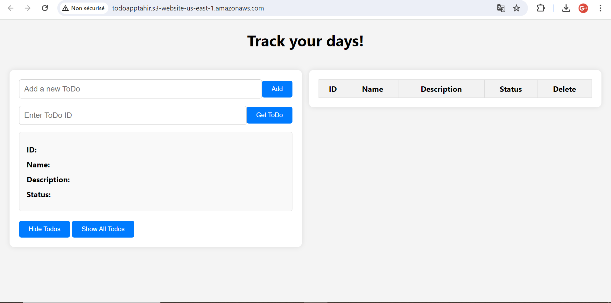

# To-Do Application

## Description
This is a simple To-Do application built using serverless architecture with AWS services. The application allows users to create, view, update, and delete tasks. It features a serverless backend using AWS Lambda functions, DynamoDB for data storage, and API Gateway to handle RESTful API requests. The front-end is hosted on Amazon S3.
## Use the app :
Access the application using the [link](http://todoapptahir.s3-website-us-east-1.amazonaws.com/)

## Architecture
The application follows a serverless architecture pattern:
- **Frontend**: HTML, CSS, and JavaScript hosted on Amazon S3.
- **Backend**: AWS Lambda functions written in Node.js, interacting with DynamoDB for data storage.
- **API**: RESTful API endpoints created using API Gateway to communicate between the frontend and backend.

## Screenshots

### Home Page:

### Adding a Task:

### Viewing Tasks:

## Setup Instructions
1. Clone the repository to your local machine.
2. Set up your AWS account and create the necessary services (Lambda, DynamoDB, API Gateway, S3).
3. Update the configuration files (`serverless.yml`, etc.) with your AWS credentials and service settings.
4. Deploy the backend services using Serverless Framework.
5. Upload the frontend files to an S3 bucket and enable static website hosting.
6. Access the application using the provided URL.

## Technologies Used
- HTML, CSS, JavaScript
- AWS Lambda
- Amazon DynamoDB
- API Gateway
- Amazon S3

## Author
TAHIR Rida

## License
This project is licensed under the [MIT License](LICENSE).

